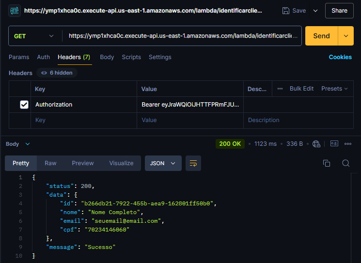

# Repositório Lambda 
## Autenticar o cliente com base no CPF

### Requisito 1 - Tech Challenge - Fase 3

* Implementar um API Gateway e um function serverless para autenticar o cliente com base no CPF

* Integrar ao sistema de autenticação para identificar o cliente.

### Solução da Arquitetura


Conforme proposto no diagrama de integração, utilizamos uma API Gateway integrada ao sistema de autenticação Cognito da AWS para segurança dos endpoints da aplicação.

A API Gateway, aciona o lambda **identificar-cliente-lambda** que por sua vez, consegue realizar uma requisição HTTP para o load balancer do EKS responsável por acionar a aplicação [fiap-self-service](https://github.com/Fiap-Self-Service/fiap-self-service) que tem acesso aos dados da aplicação e consequentemente, consegue identificar o cliente com base no CPF parametrizado no path da URL de requisição.

Exemplo CURL para requisição: 
```
curl --location 'https://ymp1xhca0c.execute-api.us-east-1.amazonaws.com/lambda/identificarcliente/{cpf}' \
--header 'Authorization: Bearer {token}' 
```

Exemplo de Response:


